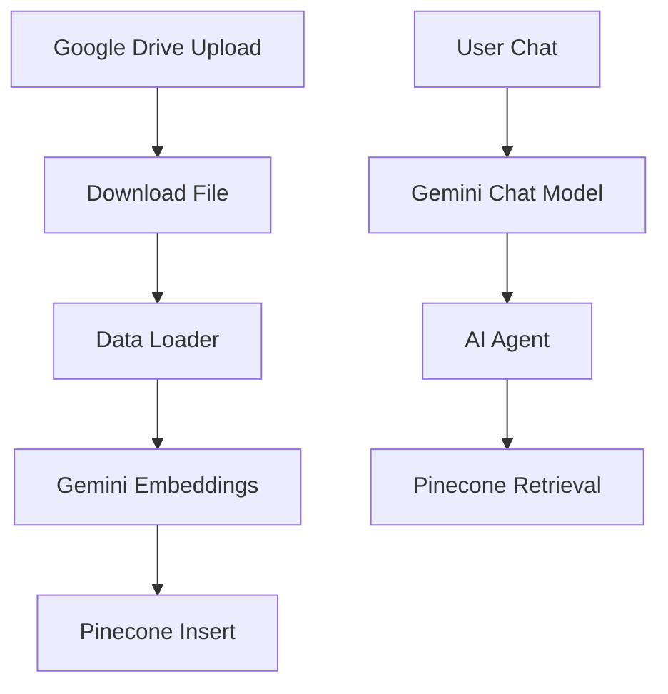

# 📄 RAG Pipeline using n8n (Google Drive + Pinecone + Gemini)

## 📌 Overview

This project implements a **Retrieval-Augmented Generation (RAG) pipeline** using **n8n**, integrating:

* Google Drive (as document source)
* Pinecone (vector database)
* Google Gemini (embeddings + LLM)

The workflow automatically ingests files (e.g., CVs) from Google Drive, converts them into embeddings, stores them in Pinecone, and enables conversational querying via an AI agent.

---

## ⚙️ Architecture

### 1. Data Ingestion Pipeline

1. **Google Drive Trigger**

   * Watches a specific folder
   * Triggers when a new file is uploaded

2. **Download File**

   * Downloads the uploaded file from Google Drive

3. **Default Data Loader**

   * Converts binary file into structured documents

4. **Google Gemini Embeddings**

   * Generates vector embeddings from document content

5. **Pinecone Vector Store (Insert Mode)**

   * Stores embeddings into Pinecone index: `n8n-drive-new`

---

### 2. Retrieval + Chat Pipeline

1. **Chat Trigger**

   * Starts workflow when a user sends a message

2. **Google Gemini Chat Model**

   * Processes user queries using Gemini LLM

3. **Pinecone Vector Store (Retrieve Mode)**

   * Retrieves relevant documents from index: `drive-n8n`
   * Namespace: `CV`

4. **AI Agent**

   * Combines retrieved context with LLM
   * Answers questions about uploaded CVs

---

## 🔄 Workflow Summary

---

## 🧠 Features

* ✅ Automated document ingestion from Google Drive
* ✅ Semantic search using vector embeddings
* ✅ Conversational AI over documents
* ✅ Scalable vector storage with Pinecone
* ✅ Fully no-code/low-code implementation in n8n

---

## 🔑 Requirements

### Accounts & APIs

* Google Drive API
* Google Gemini (PaLM) API
* Pinecone account
* n8n instance (cloud or self-hosted)

### Credentials Required in n8n

* `googleDriveOAuth2Api`
* `googlePalmApi`
* `pineconeApi`

---

## 📂 Configuration Details

### Google Drive

* Folder ID: `13ToyoowSi1Debjw9_YhpORMnoXS6Mlh-`
* Trigger: File Created

### Pinecone

* Insert Index: `n8n-drive-new`
* Retrieval Index: `drive-n8n`
* Namespace: `CV`

### Embedding Model

* Google Gemini Embeddings

### LLM

* Google Gemini Chat Model

---

## ⚠️ Known Issues & Notes

* Ensure **embedding model matches Pinecone index dimensions**
* If you encounter:

  * `vector must have at least 1 dimension` → embedding not generated correctly
  * `429 quota exceeded` → API usage limit reached
* Keep embedding model consistent between insert and retrieval

---

## 🚀 How to Use

1. Upload a document (e.g., CV PDF) to the configured Google Drive folder
2. Wait for the workflow to process and store embeddings
3. Send a query via chat trigger
4. Receive AI-generated answers based on document content

---

## 📈 Future Improvements

* Add document chunking for better retrieval accuracy
* Implement metadata filtering in Pinecone
* Add UI (e.g., Streamlit or web app)
* Support multiple document types

---

## 🏷️ Tags

`RAG` `n8n` `Pinecone` `Google Gemini` `Vector Database` `Automation` `AI Agent`

---

## 👤 Author

Puvanakopis
